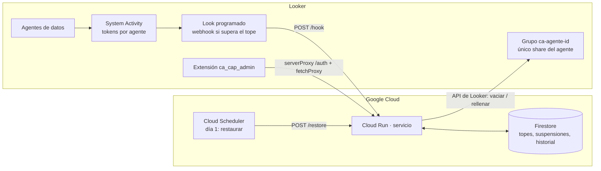

# ca-cap · Tope de tokens para agentes de Conversational Analytics en Looker

**Español** · [English](docs/README.en.md) · [Français](docs/README.fr.md) · [Deutsch](docs/README.de.md)

Looker mide los tokens que consumen los agentes de datos de Conversational Analytics (Gemini en Looker),
pero no ofrece un tope por agente. `ca-cap` lo construye encima de lo que sí existe:

- **Servicio** (Cloud Run, Python): recibe el consumo por agente, compara con el tope y, si se supera,
  retira a los usuarios del grupo con el que se comparte el agente. Guarda el estado en Firestore y
  restaura el acceso al inicio del siguiente periodo.
- **Extensión de Looker** (React): consola de administración dentro de Looker para ver consumo,
  fijar topes por agente, cortar o restaurar a mano y revisar el historial. Interfaz en ES/EN/FR/DE.

> Es un tope **aproximado**: las métricas de tokens de System Activity se refrescan una vez al día, así
> que un agente puede excederse hasta un día de consumo antes del corte. Sirve para gobernanza, no
> como límite contractual.

## Arquitectura



Cómo corta: cada agente se comparte en Looker **únicamente** con un grupo `ca-agente-<agent_id>`.
Vaciar ese grupo elimina el acceso View al agente sin tocar ningún otro permiso; la lista de miembros
queda en Firestore para restaurarla.

## Estructura del repositorio

```
service/      Servicio Flask para Cloud Run (main.py, deploy.sh, requirements.txt)
extension/    Extensión de Looker (React + webpack) → dist/bundle.js
lookml/       manifest.lkml y modelo del proyecto LookML que aloja la extensión
docs/         README en inglés, francés y alemán
.github/      Workflows: despliegue del servicio y build de la extensión
```

## Requisitos

- Looker 26.12 o superior con **Admin > Previews > Conversational Analytics Agent Token usage** activado.
- Un proyecto de Google Cloud con permisos para Cloud Run, Firestore, Secret Manager y Cloud Scheduler.
- Un usuario de servicio de Looker con rol **Admin** (la gestión de grupos no tiene permiso granular) y
  credenciales API.
- Node 20 y Python 3.12 para compilar y probar en local.

## Paso 1 · Preparar Looker

1. **Grupos por agente**: en Admin > Groups crea `ca-agente-<agent_id>` por cada agente que quieras
   topar. El `agent_id` aparece en la URL del agente (*Manage agents*) y en el Explore de System Activity.
2. **Comparte cada agente solo con su grupo** (*Manage agents > Share*, nivel View) y elimina los
   usuarios compartidos individualmente. Los usuarios siguen necesitando, por sus roles habituales,
   `chat_with_agent` y `access_data` sobre los modelos: el grupo solo transporta el share.
3. **Look de consumo**: en Admin > System Activity > dashboard *Conversational Analytics* > pestaña
   *Token usage*, abre *Explore from here* en el tile "Top Agents by Token Usage". Construye una consulta
   con ID y nombre de agente, tokens totales y filtro de fecha del periodo (p. ej. `this month`).
   Anota los nombres de campo tal como salen en la descarga JSON (`agent.id`, `usage.total_tokens`…):
   son las variables `COL_AGENT_ID`, `COL_AGENT_NAME`, `COL_TOKENS` y el Explore es `SA_EXPLORE`.
4. Guarda el Look con el usuario de servicio como dueño.

## Paso 2 · Desplegar el servicio

```bash
cd service
export PROJECT_ID=mi-proyecto REGION=us-central1
export LOOKER_BASE_URL=https://mi-instancia.cloud.looker.com
export LOOKER_CLIENT_ID=... LOOKER_CLIENT_SECRET=...
export CAP_KEY=$(openssl rand -hex 24)          # guárdalo: lo necesitan el schedule y la extensión
export JWT_SECRET=$(openssl rand -hex 32)
export COL_AGENT_ID=agent.id COL_AGENT_NAME=agent.name COL_TOKENS=usage.total_tokens
export SA_EXPLORE=<explore> SA_DATE_FIELD=<campo_fecha>   # habilita el modo pull y la pantalla de consumo
export SLACK_WEBHOOK_URL=https://hooks.slack.com/services/...   # opcional
export DRY_RUN=true                             # primera vez: no toca grupos
./deploy.sh
```

El script habilita las APIs, crea Firestore, guarda los secretos, despliega Cloud Run
(`--allow-unauthenticated`: Looker no puede enviar tokens OIDC, la protección es `CAP_KEY`) y crea los
jobs de Cloud Scheduler `ca-cap-restore` (día 1 a las 00:30) y, si hay `SA_EXPLORE`, `ca-cap-check`
(cada 6 h). Prueba con el payload de ejemplo y, cuando cuadre, vuelve a desplegar con `DRY_RUN=false`:

```bash
curl -X POST -H "Content-Type: application/json" -d @sample_webhook.json "$URL/hook?key=$CAP_KEY"
```

### Elegir el disparador

| Modo | Cómo | Cuándo usarlo |
|---|---|---|
| **Webhook** | Programa el Look hacia `$URL/hook?key=$CAP_KEY` (formato JSON, *Send if there are results*, 2–3 veces al día). El Look puede filtrar `tokens ≥ tope` o enviar todos los agentes y dejar que el servicio aplique los topes por agente. | Cuando no quieres dar acceso a System Activity al usuario de servicio. |
| **Pull** | Cloud Scheduler llama a `POST /check`; el servicio consulta System Activity por API y aplica los topes de Firestore. | Cuando quieres topes por agente editables desde la extensión sin tocar el Look. |

## Paso 3 · Instalar la extensión

1. **User attributes** (Admin > User Attributes), con nombre namespaced al proyecto y la extensión:
   - `ca_cap_ca_cap_admin_cap_key` — tipo string, **valores ocultos**, sin edición por el usuario.
     Asigna el valor `CAP_KEY` solo al grupo de administradores.
   - `ca_cap_ca_cap_admin_service_url` — tipo string, valor por defecto = URL de Cloud Run.
2. **Proyecto LookML** `ca_cap` con los archivos de `lookml/`: en `manifest.lkml` pon la URL de Cloud
   Run en `external_api_urls` y en el modelo una conexión válida (solo sirve para permisos).
3. **Compilar y subir el bundle**:
   ```bash
   cd extension && npm ci && npm run build      # genera dist/bundle.js
   ```
   Sube `dist/bundle.js` a la raíz del proyecto LookML y despliega a producción. Para desarrollo,
   sustituye `file:` por `url: "https://localhost:8080/bundle.js"` y ejecuta `npm run develop`.
4. **Permisos**: incluye el modelo `ca_cap_admin` solo en el model set de los administradores. Quien no
   tenga el user attribute con el secreto no obtiene JWT aunque abra la extensión.
5. Abre **Applications > Tope de tokens · Conversational Analytics**.

### Cómo se autentica la extensión

`extensionSDK.createSecretKeyTag('cap_key')` inserta una etiqueta que el servidor de Looker sustituye
por el valor del user attribute al ejecutar `serverProxy` contra `POST /auth`. El servicio devuelve un
JWT de 15 minutos que la extensión usa con `fetchProxy` (`Authorization: Bearer`). El secreto nunca
llega al navegador. `fetchProxy` sale desde el navegador, por eso el servicio habilita CORS para el
origen de tu instancia (`CORS_ORIGINS`).

## Uso de la extensión

- **Consumo y topes**: tokens del periodo por agente (System Activity), tope, % consumido, estado.
  Edita o quita topes, añade un tope a un agente por ID, corta ahora o restaura, y evalúa los topes al
  instante (`/check`).
- **Suspensiones**: agentes cortados, grupo, usuarios retirados, origen (`webhook`, `check`, `manual`)
  y quién lo hizo. Restaura uno o todos.
- **Historial**: cortes y restauraciones con detalle.

## API del servicio

Autenticación: cabecera `X-Cap-Key` (automatizaciones) o `Authorization: Bearer <jwt>` (extensión).

| Método y ruta | Descripción |
|---|---|
| `POST /auth` | Cambia `cap_key` por un JWT |
| `GET /config` | Configuración efectiva (explore, campos, prefijo de grupo, tope global) |
| `GET /caps` · `PUT /caps/{id}` · `DELETE /caps/{id}` | Topes por agente |
| `GET /suspensions` | Suspensiones activas |
| `GET /history?limit=100` | Historial |
| `POST /suspend/{id}` | Corte manual |
| `POST /restore[?agent_id=]` | Restaurar todo o un agente |
| `POST /hook` | Webhook del schedule de Looker |
| `POST /check` | Evaluación en modo pull |

Variables de entorno: ver `service/.env.example`.

## CI/CD

- `service.yml`: prueba de humo y despliegue a Cloud Run con Workload Identity Federation al cambiar
  `service/**`. Secrets: `GCP_WIF_PROVIDER`, `GCP_SERVICE_ACCOUNT`; variables: `GCP_PROJECT_ID`,
  `GCP_REGION`, `CA_CAP_SERVICE`. La configuración del servicio se conserva entre revisiones.
- `extension.yml`: compila el bundle en cada cambio de `extension/**` y lo publica como artefacto; con
  un tag `v*` crea una release con `bundle.js` listo para subir al proyecto LookML.

## Limitaciones

- Retraso de hasta 24 h en las métricas; el día en curso aparece como estimado.
- Las conversaciones directas con Explores (sin agente) no pasan por ningún grupo de agente.
- Los usuarios retirados conservan acceso uno o dos minutos mientras se propaga; después ven las
  conversaciones pasadas pero no pueden preguntar.
- No se cuentan los tokens de agentes de Looker usados desde Gemini Enterprise.
- La cuota real de Looker es agrupada por instancia: este tope es una regla tuya, no de facturación.

## Licencia

MIT. Ver [LICENSE](LICENSE).
