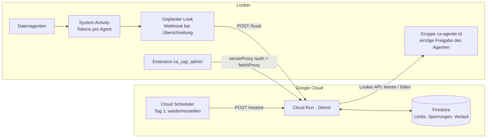

# ca-cap · Token-Limit für Conversational-Analytics-Agenten in Looker

[Español](../README.md) · [English](README.en.md) · [Français](README.fr.md) · **Deutsch**

Looker misst die Tokens, die Conversational-Analytics-Datenagenten (Gemini in Looker) verbrauchen,
bietet aber kein Limit pro Agent. `ca-cap` baut eines auf dem auf, was vorhanden ist:

- **Dienst** (Cloud Run, Python): empfängt den Verbrauch pro Agent, vergleicht ihn mit dem Limit und
  entfernt bei Überschreitung die Nutzer aus der Gruppe, mit der der Agent geteilt ist. Der Zustand
  liegt in Firestore, der Zugriff wird zu Beginn des nächsten Zeitraums wiederhergestellt.
- **Looker-Extension** (React): Verwaltungskonsole in Looker, um Verbrauch zu sehen, Limits pro Agent
  festzulegen, manuell zu sperren oder wiederherzustellen und den Verlauf zu prüfen. Oberfläche in
  ES/EN/FR/DE.

> Das Limit ist **näherungsweise**: Die Token-Metriken von System Activity werden einmal täglich
> aktualisiert, ein Agent kann das Limit also um bis zu einen Tag Verbrauch überschreiten, bevor er
> gesperrt wird. Geeignet für Governance, nicht als vertragliche Grenze.

## Architektur



So funktioniert die Sperrung: Jeder Agent wird in Looker **ausschließlich** mit einer Gruppe
`ca-agente-<agent_id>` geteilt. Diese Gruppe zu leeren entzieht den View-Zugriff auf den Agenten, ohne
andere Berechtigungen zu berühren; die Mitgliederliste bleibt zur Wiederherstellung in Firestore.

## Aufbau des Repositorys

```
service/      Flask-Dienst für Cloud Run (main.py, deploy.sh, requirements.txt)
extension/    Looker-Extension (React + webpack) → dist/bundle.js
lookml/       manifest.lkml und Modell des LookML-Projekts, das die Extension hostet
docs/         README auf Englisch, Französisch und Deutsch
.github/      Workflows: Bereitstellung des Dienstes und Build der Extension
```

## Voraussetzungen

- Looker 26.12 oder neuer mit aktivierter Vorschau **Admin > Previews > Conversational Analytics Agent
  Token usage**.
- Ein Google-Cloud-Projekt mit Rechten für Cloud Run, Firestore, Secret Manager und Cloud Scheduler.
- Ein Looker-Dienstnutzer mit der Rolle **Admin** (Gruppenverwaltung hat keine feingranulare
  Berechtigung) und API-Zugangsdaten.
- Node 20 und Python 3.12 zum lokalen Bauen und Testen.

## Schritt 1 · Looker vorbereiten

1. **Eine Gruppe pro Agent**: Lege unter Admin > Groups für jeden zu limitierenden Agenten
   `ca-agente-<agent_id>` an. Die `agent_id` steht in der URL des Agenten (*Manage agents*) und im
   System-Activity-Explore.
2. **Teile jeden Agenten nur mit seiner Gruppe** (*Manage agents > Share*, Stufe View) und entferne
   einzeln geteilte Nutzer. Die Nutzer brauchen weiterhin über ihre üblichen Rollen `chat_with_agent`
   und `access_data` auf die Modelle: Die Gruppe transportiert nur die Freigabe.
3. **Verbrauchs-Look**: Öffne unter Admin > System Activity > Dashboard *Conversational Analytics* >
   Tab *Token usage* über die Kachel „Top Agents by Token Usage“ *Explore from here*. Baue eine Abfrage
   mit Agenten-ID und -Name, Gesamt-Tokens und einem Datumsfilter für den Zeitraum (z. B.
   `this month`). Notiere die Feldnamen genau so, wie sie im JSON-Download erscheinen (`agent.id`,
   `usage.total_tokens` …): Das sind die Variablen `COL_AGENT_ID`, `COL_AGENT_NAME`, `COL_TOKENS`, das
   Explore ist `SA_EXPLORE`.
4. Speichere den Look mit dem Dienstnutzer als Eigentümer.

## Schritt 2 · Dienst bereitstellen

```bash
cd service
export PROJECT_ID=mein-projekt REGION=us-central1
export LOOKER_BASE_URL=https://meine-instanz.cloud.looker.com
export LOOKER_CLIENT_ID=... LOOKER_CLIENT_SECRET=...
export CAP_KEY=$(openssl rand -hex 24)          # aufbewahren: Zeitplan und Extension brauchen ihn
export JWT_SECRET=$(openssl rand -hex 32)
export COL_AGENT_ID=agent.id COL_AGENT_NAME=agent.name COL_TOKENS=usage.total_tokens
export SA_EXPLORE=<explore> SA_DATE_FIELD=<datumsfeld>   # aktiviert Pull-Modus und Verbrauchsansicht
export SLACK_WEBHOOK_URL=https://hooks.slack.com/services/...   # optional
export DRY_RUN=true                             # erster Lauf: Gruppen werden nicht verändert
./deploy.sh
```

Das Skript aktiviert die APIs, legt Firestore an, speichert die Secrets, stellt Cloud Run bereit
(`--allow-unauthenticated`: Looker kann keine OIDC-Tokens senden, `CAP_KEY` ist der Schutz) und legt
die Cloud-Scheduler-Jobs `ca-cap-restore` (Tag 1 um 00:30) und, falls `SA_EXPLORE` gesetzt ist,
`ca-cap-check` (alle 6 h) an. Teste mit der Beispiel-Payload und stelle danach mit `DRY_RUN=false`
erneut bereit:

```bash
curl -X POST -H "Content-Type: application/json" -d @sample_webhook.json "$URL/hook?key=$CAP_KEY"
```

### Auslöser wählen

| Modus | Wie | Wann |
|---|---|---|
| **Webhook** | Plane den Look auf `$URL/hook?key=$CAP_KEY` (Format JSON, *Send if there are results*, 2–3-mal täglich). Der Look kann nach `tokens ≥ Limit` filtern oder alle Agenten senden und den Dienst die Limits pro Agent anwenden lassen. | Wenn der Dienstnutzer keinen Zugriff auf System Activity erhalten soll. |
| **Pull** | Cloud Scheduler ruft `POST /check` auf; der Dienst fragt System Activity über die API ab und wendet die in Firestore gespeicherten Limits an. | Wenn Limits pro Agent aus der Extension heraus änderbar sein sollen, ohne den Look anzufassen. |

## Schritt 3 · Extension installieren

1. **User Attributes** (Admin > User Attributes), benannt nach Projekt und Extension:
   - `ca_cap_ca_cap_admin_cap_key` — String, **Werte verborgen**, nicht durch Nutzer editierbar. Weise
     den Wert `CAP_KEY` nur der Admin-Gruppe zu.
   - `ca_cap_ca_cap_admin_service_url` — String, Standardwert = Cloud-Run-URL.
2. **LookML-Projekt** `ca_cap` mit den Dateien aus `lookml/`: Trage in `manifest.lkml` die
   Cloud-Run-URL unter `external_api_urls` ein und im Modell eine gültige Verbindung (nur für
   Berechtigungen nötig).
3. **Bundle bauen und hochladen**:
   ```bash
   cd extension && npm ci && npm run build      # erzeugt dist/bundle.js
   ```
   Lade `dist/bundle.js` in das Wurzelverzeichnis des LookML-Projekts und deploye nach Produktion. Für
   die Entwicklung ersetze `file:` durch `url: "https://localhost:8080/bundle.js"` und starte
   `npm run develop`.
4. **Berechtigungen**: Nimm das Modell `ca_cap_admin` nur in das Model Set der Administratoren auf.
   Ohne das geheime User Attribute gibt es kein JWT, auch wenn die Extension geöffnet wird.
5. Öffne **Applications > Tope de tokens · Conversational Analytics**.

### Authentifizierung der Extension

`extensionSDK.createSecretKeyTag('cap_key')` fügt eine Markierung ein, die der Looker-Server beim
`serverProxy`-Aufruf an `POST /auth` durch den Wert des User Attributes ersetzt. Der Dienst gibt ein
15-Minuten-JWT zurück, das die Extension mit `fetchProxy` (`Authorization: Bearer`) verwendet. Das
Secret erreicht den Browser nie. `fetchProxy` läuft im Browser, deshalb aktiviert der Dienst CORS für
den Origin deiner Instanz (`CORS_ORIGINS`).

## Verwendung der Extension

- **Verbrauch und Limits**: Tokens des Zeitraums pro Agent (System Activity), Limit, verbrauchter
  Anteil, Status. Limits bearbeiten oder entfernen, Limit für einen Agenten per ID hinzufügen, sofort
  sperren oder wiederherstellen und Limits sofort prüfen (`/check`).
- **Sperrungen**: gesperrte Agenten, Gruppe, entfernte Nutzer, Quelle (`webhook`, `check`, `manual`) und
  Urheber. Einen oder alle wiederherstellen.
- **Verlauf**: Sperrungen und Wiederherstellungen mit Details.

## API des Dienstes

Authentifizierung: Header `X-Cap-Key` (Automatisierungen) oder `Authorization: Bearer <jwt>`
(Extension).

| Methode und Pfad | Beschreibung |
|---|---|
| `POST /auth` | Tauscht `cap_key` gegen ein JWT |
| `GET /config` | Wirksame Konfiguration (Explore, Felder, Gruppenpräfix, globales Limit) |
| `GET /caps` · `PUT /caps/{id}` · `DELETE /caps/{id}` | Limits pro Agent |
| `GET /suspensions` | Aktive Sperrungen |
| `GET /history?limit=100` | Verlauf |
| `POST /suspend/{id}` | Manuelle Sperrung |
| `POST /restore[?agent_id=]` | Alle oder einen Agenten wiederherstellen |
| `POST /hook` | Webhook des Looker-Zeitplans |
| `POST /check` | Prüfung im Pull-Modus |

Umgebungsvariablen: siehe `service/.env.example`.

## CI/CD

- `service.yml`: Smoke-Test und Cloud-Run-Deployment mit Workload Identity Federation bei Änderungen
  an `service/**`. Secrets: `GCP_WIF_PROVIDER`, `GCP_SERVICE_ACCOUNT`; Variablen: `GCP_PROJECT_ID`,
  `GCP_REGION`, `CA_CAP_SERVICE`. Die Dienstkonfiguration bleibt zwischen Revisionen erhalten.
- `extension.yml`: baut das Bundle bei jeder Änderung an `extension/**` und veröffentlicht es als
  Artefakt; ein Tag `v*` erzeugt ein Release mit `bundle.js`, bereit zum Hochladen in das
  LookML-Projekt.

## Einschränkungen

- Bis zu 24 h Verzögerung der Metriken; der laufende Tag ist eine Schätzung.
- Direkte Unterhaltungen mit Explores (ohne Agent) laufen über keine Agentengruppe.
- Entfernte Nutzer behalten den Zugriff ein bis zwei Minuten, bis die Änderung wirksam ist; danach sehen
  sie vergangene Unterhaltungen, können aber keine Fragen mehr stellen.
- Tokens von Looker-Agenten, die aus Gemini Enterprise genutzt werden, werden nicht gezählt.
- Das tatsächliche Looker-Kontingent gilt pro Instanz: Dieses Limit ist deine eigene Regel, keine
  Abrechnungsregel.

## Lizenz

MIT. Siehe [LICENSE](../LICENSE).
