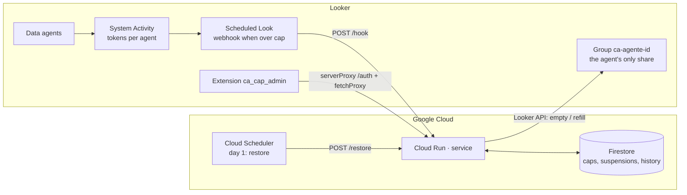

# ca-cap · Token cap for Conversational Analytics agents in Looker

[Español](../README.md) · **English** · [Français](README.fr.md) · [Deutsch](README.de.md)

Looker measures the tokens consumed by Conversational Analytics data agents (Gemini in Looker), but it
does not offer a per-agent cap. `ca-cap` builds one on top of what does exist:

- **Service** (Cloud Run, Python): receives per-agent usage, compares it with the cap and, when it is
  exceeded, removes the users from the group the agent is shared with. State lives in Firestore and
  access is restored at the start of the next period.
- **Looker extension** (React): an admin console inside Looker to see usage, set per-agent caps,
  suspend or restore manually and review the history. UI in ES/EN/FR/DE.

> This is an **approximate** cap: System Activity token metrics refresh once a day, so an agent can
> overshoot by up to one day of usage before it is cut off. Use it for governance, not as a contractual
> limit.

## Architecture



How the cut works: each agent is shared in Looker **only** with a group named `ca-agente-<agent_id>`.
Emptying that group removes View access to the agent without touching any other permission; the member
list is kept in Firestore so it can be restored.

## Repository layout

```
service/      Flask service for Cloud Run (main.py, deploy.sh, requirements.txt)
extension/    Looker extension (React + webpack) → dist/bundle.js
lookml/       manifest.lkml and model for the LookML project that hosts the extension
docs/         README in English, French and German
.github/      Workflows: service deployment and extension build
```

## Requirements

- Looker 26.12 or later with **Admin > Previews > Conversational Analytics Agent Token usage** enabled.
- A Google Cloud project with permissions for Cloud Run, Firestore, Secret Manager and Cloud Scheduler.
- A Looker service user with the **Admin** role (group management has no granular permission) and API
  credentials.
- Node 20 and Python 3.12 to build and test locally.

## Step 1 · Prepare Looker

1. **One group per agent**: in Admin > Groups create `ca-agente-<agent_id>` for every agent you want to
   cap. The `agent_id` appears in the agent's URL (*Manage agents*) and in the System Activity Explore.
2. **Share each agent only with its group** (*Manage agents > Share*, View level) and remove any users
   shared individually. Users still need `chat_with_agent` and `access_data` on the models through their
   usual roles: the group only carries the share.
3. **Usage Look**: in Admin > System Activity > *Conversational Analytics* dashboard > *Token usage* tab,
   open *Explore from here* on the "Top Agents by Token Usage" tile. Build a query with agent ID and
   name, total tokens and a date filter for the period (e.g. `this month`). Note the field names exactly
   as they appear in the JSON download (`agent.id`, `usage.total_tokens`…): they are the
   `COL_AGENT_ID`, `COL_AGENT_NAME`, `COL_TOKENS` variables, and the Explore is `SA_EXPLORE`.
4. Save the Look with the service user as owner.

## Step 2 · Deploy the service

```bash
cd service
export PROJECT_ID=my-project REGION=us-central1
export LOOKER_BASE_URL=https://my-instance.cloud.looker.com
export LOOKER_CLIENT_ID=... LOOKER_CLIENT_SECRET=...
export CAP_KEY=$(openssl rand -hex 24)          # keep it: the schedule and the extension need it
export JWT_SECRET=$(openssl rand -hex 32)
export COL_AGENT_ID=agent.id COL_AGENT_NAME=agent.name COL_TOKENS=usage.total_tokens
export SA_EXPLORE=<explore> SA_DATE_FIELD=<date_field>   # enables pull mode and the usage screen
export SLACK_WEBHOOK_URL=https://hooks.slack.com/services/...   # optional
export DRY_RUN=true                             # first run: groups are not touched
./deploy.sh
```

The script enables the APIs, creates Firestore, stores the secrets, deploys Cloud Run
(`--allow-unauthenticated`: Looker cannot send OIDC tokens, `CAP_KEY` is the protection) and creates the
Cloud Scheduler jobs `ca-cap-restore` (day 1 at 00:30) and, when `SA_EXPLORE` is set, `ca-cap-check`
(every 6 h). Test with the sample payload and, once it looks right, redeploy with `DRY_RUN=false`:

```bash
curl -X POST -H "Content-Type: application/json" -d @sample_webhook.json "$URL/hook?key=$CAP_KEY"
```

### Choosing the trigger

| Mode | How | When to use it |
|---|---|---|
| **Webhook** | Schedule the Look to `$URL/hook?key=$CAP_KEY` (JSON format, *Send if there are results*, 2–3 times a day). The Look can filter `tokens ≥ cap`, or send every agent and let the service apply per-agent caps. | When you do not want to give the service user access to System Activity. |
| **Pull** | Cloud Scheduler calls `POST /check`; the service queries System Activity through the API and applies the caps stored in Firestore. | When you want per-agent caps editable from the extension without touching the Look. |

## Step 3 · Install the extension

1. **User attributes** (Admin > User Attributes), namespaced to the project and the extension:
   - `ca_cap_ca_cap_admin_cap_key` — string, **hidden values**, not user-editable. Assign the `CAP_KEY`
     value only to the admin group.
   - `ca_cap_ca_cap_admin_service_url` — string, default value = the Cloud Run URL.
2. **LookML project** `ca_cap` with the files in `lookml/`: in `manifest.lkml` put the Cloud Run URL in
   `external_api_urls`, and in the model a valid connection (it only exists for permissions).
3. **Build and upload the bundle**:
   ```bash
   cd extension && npm ci && npm run build      # produces dist/bundle.js
   ```
   Upload `dist/bundle.js` to the root of the LookML project and deploy to production. For development,
   replace `file:` with `url: "https://localhost:8080/bundle.js"` and run `npm run develop`.
4. **Permissions**: include the `ca_cap_admin` model only in the admins' model set. Anyone without the
   secret user attribute gets no JWT even if they open the extension.
5. Open **Applications > Tope de tokens · Conversational Analytics**.

### How the extension authenticates

`extensionSDK.createSecretKeyTag('cap_key')` inserts a tag that the Looker server replaces with the
user attribute value when running `serverProxy` against `POST /auth`. The service returns a 15-minute
JWT that the extension uses with `fetchProxy` (`Authorization: Bearer`). The secret never reaches the
browser. `fetchProxy` runs from the browser, which is why the service enables CORS for your instance's
origin (`CORS_ORIGINS`).

## Using the extension

- **Usage and caps**: tokens for the period per agent (System Activity), cap, % consumed, status.
  Edit or remove caps, add a cap for an agent by ID, suspend now or restore, and evaluate the caps
  immediately (`/check`).
- **Suspensions**: suspended agents, group, removed users, source (`webhook`, `check`, `manual`) and
  who did it. Restore one or all.
- **History**: suspensions and restores with details.

## Service API

Authentication: `X-Cap-Key` header (automations) or `Authorization: Bearer <jwt>` (extension).

| Method and path | Description |
|---|---|
| `POST /auth` | Exchanges `cap_key` for a JWT |
| `GET /config` | Effective configuration (explore, fields, group prefix, global cap) |
| `GET /caps` · `PUT /caps/{id}` · `DELETE /caps/{id}` | Per-agent caps |
| `GET /suspensions` | Active suspensions |
| `GET /history?limit=100` | History |
| `POST /suspend/{id}` | Manual suspension |
| `POST /restore[?agent_id=]` | Restore all or one agent |
| `POST /hook` | Looker schedule webhook |
| `POST /check` | Pull-mode evaluation |

Environment variables: see `service/.env.example`.

## CI/CD

- `service.yml`: smoke test and Cloud Run deployment with Workload Identity Federation whenever
  `service/**` changes. Secrets: `GCP_WIF_PROVIDER`, `GCP_SERVICE_ACCOUNT`; variables:
  `GCP_PROJECT_ID`, `GCP_REGION`, `CA_CAP_SERVICE`. The service configuration is kept between revisions.
- `extension.yml`: builds the bundle on every change to `extension/**` and publishes it as an artifact;
  a `v*` tag creates a release with `bundle.js` ready to upload to the LookML project.

## Limitations

- Up to 24 h of delay in the metrics; the current day is shown as an estimate.
- Direct conversations with Explores (without an agent) do not go through any agent group.
- Removed users keep access for a minute or two while the change propagates; afterwards they can see
  past conversations but cannot ask new questions.
- Tokens of Looker agents used from Gemini Enterprise are not counted.
- Looker's real quota is pooled per instance: this cap is your own rule, not a billing one.

## License

MIT. See [LICENSE](../LICENSE).
