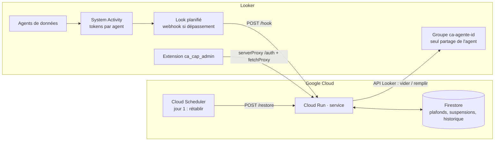

# ca-cap · Plafond de tokens pour les agents Conversational Analytics dans Looker

[Español](../README.md) · [English](README.en.md) · **Français** · [Deutsch](README.de.md)

Looker mesure les tokens consommés par les agents de données Conversational Analytics (Gemini dans
Looker), mais n'offre pas de plafond par agent. `ca-cap` en construit un au-dessus de ce qui existe :

- **Service** (Cloud Run, Python) : reçoit la consommation par agent, la compare au plafond et, s'il est
  dépassé, retire les utilisateurs du groupe avec lequel l'agent est partagé. L'état est conservé dans
  Firestore et l'accès est rétabli au début de la période suivante.
- **Extension Looker** (React) : console d'administration dans Looker pour voir la consommation, fixer
  des plafonds par agent, suspendre ou rétablir manuellement et consulter l'historique. Interface en
  ES/EN/FR/DE.

> C'est un plafond **approximatif** : les métriques de tokens de System Activity se rafraîchissent une
> fois par jour, un agent peut donc dépasser le plafond d'une journée de consommation avant la coupure.
> Utile pour la gouvernance, pas comme limite contractuelle.

## Architecture



Fonctionnement de la coupure : chaque agent est partagé dans Looker **uniquement** avec un groupe
`ca-agente-<agent_id>`. Vider ce groupe supprime l'accès View à l'agent sans toucher à aucune autre
permission ; la liste des membres est conservée dans Firestore pour le rétablissement.

## Structure du dépôt

```
service/      Service Flask pour Cloud Run (main.py, deploy.sh, requirements.txt)
extension/    Extension Looker (React + webpack) → dist/bundle.js
lookml/       manifest.lkml et modèle du projet LookML qui héberge l'extension
docs/         README en anglais, français et allemand
.github/      Workflows : déploiement du service et build de l'extension
```

## Prérequis

- Looker 26.12 ou plus récent avec **Admin > Previews > Conversational Analytics Agent Token usage**
  activé.
- Un projet Google Cloud avec les droits Cloud Run, Firestore, Secret Manager et Cloud Scheduler.
- Un utilisateur de service Looker avec le rôle **Admin** (la gestion des groupes n'a pas de permission
  granulaire) et des identifiants API.
- Node 20 et Python 3.12 pour compiler et tester en local.

## Étape 1 · Préparer Looker

1. **Un groupe par agent** : dans Admin > Groups, créez `ca-agente-<agent_id>` pour chaque agent à
   plafonner. L'`agent_id` figure dans l'URL de l'agent (*Manage agents*) et dans l'Explore System
   Activity.
2. **Partagez chaque agent uniquement avec son groupe** (*Manage agents > Share*, niveau View) et
   retirez les utilisateurs partagés individuellement. Les utilisateurs ont toujours besoin, via leurs
   rôles habituels, de `chat_with_agent` et `access_data` sur les modèles : le groupe ne porte que le
   partage.
3. **Look de consommation** : dans Admin > System Activity > tableau de bord *Conversational Analytics*
   > onglet *Token usage*, ouvrez *Explore from here* sur la tuile « Top Agents by Token Usage ».
   Construisez une requête avec l'ID et le nom de l'agent, les tokens totaux et un filtre de date sur la
   période (par ex. `this month`). Notez les noms de champs tels qu'ils apparaissent dans l'export JSON
   (`agent.id`, `usage.total_tokens`…) : ce sont les variables `COL_AGENT_ID`, `COL_AGENT_NAME`,
   `COL_TOKENS`, et l'Explore est `SA_EXPLORE`.
4. Enregistrez le Look avec l'utilisateur de service comme propriétaire.

## Étape 2 · Déployer le service

```bash
cd service
export PROJECT_ID=mon-projet REGION=us-central1
export LOOKER_BASE_URL=https://mon-instance.cloud.looker.com
export LOOKER_CLIENT_ID=... LOOKER_CLIENT_SECRET=...
export CAP_KEY=$(openssl rand -hex 24)          # conservez-le : la planification et l'extension en ont besoin
export JWT_SECRET=$(openssl rand -hex 32)
export COL_AGENT_ID=agent.id COL_AGENT_NAME=agent.name COL_TOKENS=usage.total_tokens
export SA_EXPLORE=<explore> SA_DATE_FIELD=<champ_date>   # active le mode pull et l'écran de consommation
export SLACK_WEBHOOK_URL=https://hooks.slack.com/services/...   # optionnel
export DRY_RUN=true                             # premier lancement : les groupes ne sont pas modifiés
./deploy.sh
```

Le script active les API, crée Firestore, enregistre les secrets, déploie Cloud Run
(`--allow-unauthenticated` : Looker ne peut pas envoyer de jeton OIDC, la protection est `CAP_KEY`) et
crée les tâches Cloud Scheduler `ca-cap-restore` (le 1er à 00h30) et, si `SA_EXPLORE` est défini,
`ca-cap-check` (toutes les 6 h). Testez avec la charge utile d'exemple puis redéployez avec
`DRY_RUN=false` :

```bash
curl -X POST -H "Content-Type: application/json" -d @sample_webhook.json "$URL/hook?key=$CAP_KEY"
```

### Choisir le déclencheur

| Mode | Comment | Quand l'utiliser |
|---|---|---|
| **Webhook** | Planifiez le Look vers `$URL/hook?key=$CAP_KEY` (format JSON, *Send if there are results*, 2 à 3 fois par jour). Le Look peut filtrer `tokens ≥ plafond`, ou envoyer tous les agents et laisser le service appliquer les plafonds par agent. | Quand vous ne voulez pas donner l'accès à System Activity à l'utilisateur de service. |
| **Pull** | Cloud Scheduler appelle `POST /check` ; le service interroge System Activity via l'API et applique les plafonds stockés dans Firestore. | Quand vous voulez des plafonds par agent modifiables depuis l'extension sans toucher au Look. |

## Étape 3 · Installer l'extension

1. **User attributes** (Admin > User Attributes), nommés selon le projet et l'extension :
   - `ca_cap_ca_cap_admin_cap_key` — chaîne, **valeurs masquées**, non modifiable par l'utilisateur.
     Attribuez la valeur `CAP_KEY` uniquement au groupe des administrateurs.
   - `ca_cap_ca_cap_admin_service_url` — chaîne, valeur par défaut = URL Cloud Run.
2. **Projet LookML** `ca_cap` avec les fichiers de `lookml/` : dans `manifest.lkml`, renseignez l'URL
   Cloud Run dans `external_api_urls`, et dans le modèle une connexion valide (il ne sert qu'aux
   permissions).
3. **Compiler et téléverser le bundle** :
   ```bash
   cd extension && npm ci && npm run build      # génère dist/bundle.js
   ```
   Téléversez `dist/bundle.js` à la racine du projet LookML et déployez en production. Pour le
   développement, remplacez `file:` par `url: "https://localhost:8080/bundle.js"` et lancez
   `npm run develop`.
4. **Permissions** : incluez le modèle `ca_cap_admin` uniquement dans le model set des administrateurs.
   Sans le user attribute secret, aucun JWT n'est délivré même si l'extension est ouverte.
5. Ouvrez **Applications > Tope de tokens · Conversational Analytics**.

### Authentification de l'extension

`extensionSDK.createSecretKeyTag('cap_key')` insère une balise que le serveur Looker remplace par la
valeur du user attribute lors de l'appel `serverProxy` vers `POST /auth`. Le service renvoie un JWT de
15 minutes que l'extension utilise avec `fetchProxy` (`Authorization: Bearer`). Le secret n'atteint
jamais le navigateur. `fetchProxy` part du navigateur, d'où l'activation de CORS côté service pour
l'origine de votre instance (`CORS_ORIGINS`).

## Utilisation de l'extension

- **Consommation et plafonds** : tokens de la période par agent (System Activity), plafond, %
  consommé, état. Modifiez ou retirez des plafonds, ajoutez un plafond à un agent par ID, suspendez ou
  rétablissez, et évaluez les plafonds immédiatement (`/check`).
- **Suspensions** : agents suspendus, groupe, utilisateurs retirés, origine (`webhook`, `check`,
  `manual`) et auteur. Rétablissez un agent ou tous.
- **Historique** : suspensions et rétablissements détaillés.

## API du service

Authentification : en-tête `X-Cap-Key` (automatisations) ou `Authorization: Bearer <jwt>` (extension).

| Méthode et chemin | Description |
|---|---|
| `POST /auth` | Échange `cap_key` contre un JWT |
| `GET /config` | Configuration effective (explore, champs, préfixe de groupe, plafond global) |
| `GET /caps` · `PUT /caps/{id}` · `DELETE /caps/{id}` | Plafonds par agent |
| `GET /suspensions` | Suspensions actives |
| `GET /history?limit=100` | Historique |
| `POST /suspend/{id}` | Suspension manuelle |
| `POST /restore[?agent_id=]` | Rétablir tout ou un agent |
| `POST /hook` | Webhook de la planification Looker |
| `POST /check` | Évaluation en mode pull |

Variables d'environnement : voir `service/.env.example`.

## CI/CD

- `service.yml` : test de fumée et déploiement Cloud Run avec Workload Identity Federation à chaque
  modification de `service/**`. Secrets : `GCP_WIF_PROVIDER`, `GCP_SERVICE_ACCOUNT` ; variables :
  `GCP_PROJECT_ID`, `GCP_REGION`, `CA_CAP_SERVICE`. La configuration du service est conservée entre
  les révisions.
- `extension.yml` : compile le bundle à chaque modification de `extension/**` et le publie comme
  artefact ; un tag `v*` crée une release avec `bundle.js` prêt à être téléversé dans le projet LookML.

## Limites

- Jusqu'à 24 h de retard sur les métriques ; le jour en cours est une estimation.
- Les conversations directes avec des Explores (sans agent) ne passent par aucun groupe d'agent.
- Les utilisateurs retirés conservent l'accès une ou deux minutes le temps de la propagation ; ensuite
  ils voient les conversations passées mais ne peuvent plus poser de questions.
- Les tokens des agents Looker utilisés depuis Gemini Enterprise ne sont pas comptés.
- Le quota réel de Looker est mutualisé par instance : ce plafond est votre règle, pas une règle de
  facturation.

## Licence

MIT. Voir [LICENSE](../LICENSE).
